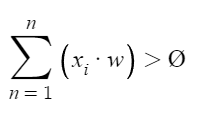
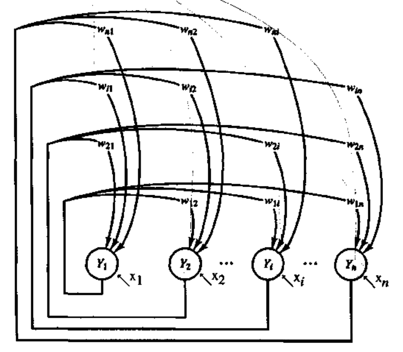

# Introduction to Neural Computation Course Materials

> Architectures and Algorithms:

### <i>McCulloch-Pitts neuron:</i>

**Introduction**:
the result neuron will output 1 if:



else it's will return 0, and if one of the negative inputs are on (value = 1) the result will be also 0.

**Parameters**:

* n positive input neuron (x_1, x_2, ..., x_n)
* m negative input neuron (x_n+1, x_n+2, ..., x_m+n)
* all weights of the positive neurons is w > 0
* all weights if the negative neurons is -p < 0
* threshold Ø


### <i>The perceptron:</i>

**Parameters**:

* input vector x = (x_1, ..., x_n)
* n weights (w_1, w_2, ..., w_n)
* bias, when his value is 1 and weight is -Ø
* threshold Ø
* learning rate 0 < α < 1


**Algorithm**:

```
1. initialize weights to be 0 and set the bias to be "on" (value=1) with wight of -Ø (threshold)
2. while there is no stop condition:
    2.1. for each input train vector x = (x_1, ..., x_n) we get the wanted result t:
    2.2. insert vector to perceptron inputes
    2.3. calculate:
         y_in = bias + SUM(i) { x_i * w_i }
         y_i = {
                1 if y_in > Ø,
                0 if -Ø <= y_in <= Ø,
               -1 if y_in < Ø
                }
         2.3.1. check if y_i != t
             2.3.2.1. update weights by:
                      w_i(new) = w_i(old) + α * (x_i * t)
             2.3.2.2. update bias by:
                      bias(new) = bias(old) + α * t
        2.3.2. if there is no changes in steps 2.2.2.1 and 2.2.2.2, stop
```

### <i>Adaline net:</i>

**Introduction**:
Adaline is a single layer neural network with multiple nodes where each node accepts multiple inputs and generate one
outputs.

**Parameters**:

* input vector x = (x_1, ..., x_n)
* bias b
* threshold Ø
* number of iterations
* learning rate 0 < α < 1


**Algorithm**:

```
1. initialize random small weights
2. for each k in number of iterations:
    2.1. for each input train vector x:
        2.1.1. update the wight and bias:
               2.1.1.1. w_i(new) = w_i(old) + α * (t_i - y_in) * xi
               2.1.1.2. b(new) = b(old) + α * (t - y_in)
               2.1.1.3. where y_in = f(y_i)
               2.1.1.4. where y_i = b + Sigma(i) { w_i * x_i }
```

## Summary of the different between perceptron and adaline:


### <i>FeedForward networks & BackPropagation</i>

**Introduction**:
FeedForward networks is neural network with hidden layers (beside the input and output layers), each neuron is connected
to each neuron on the next layer, to the hidden layers there is bias (neuron there is always 1) connected, after the
BackPropagation algorithm (calculate the error values of the weight) we're going backward the network to update the
weights.

**Parameters**:

* input vector x = (x_1, ..., x_n)
* activation function f(x) = 1 / (1 + e^(-x))
* bias b
* learning rate 0 < α < 1


**Algorithm**:

```
for each train vector we insert to the network there is 3 main steps:
1. FeedForward:
     1.1. we train the network by inserting the vector x to the input layer.
     1.2. we calulate each output of the neuron in j layer by:
     1.3. y_in = Sigma(i) { x_i * w_i } + b_j
     1.4. y_i = f(y_in)
2. BackPropagation:
     2.1. after we done to train our network with the train vector x we got for each layer k the result y_k and the wanted value t_k
     2.2. we calculate the sum error value of each layer by:
     2.3. δ_k = (t_k - y_k) * (y_in_k)
2. Update the weights
     3.1. after calculating all the layers sum error we update the weights of the each layer by:
     3.2. w_jk(new) = w_jk(old) + Δw_jk
     3.3. when Δw_jk = α * δ_k * z_j
```

### <i>Discrete Hopfield net:</i>

**Parameters**:

* input vector x = (x_1, ..., x_n)
* n*n weights
* threshold Ø



**Algorithm**:

```
1. initialize the matrix W (size n*n) by:
    for each w (weight) and p (train vector):
        1.1. W_ji = Sigma(p) { (2*s_i(p) - 1) * (2*t_i(p) - 1) } (for each i != j)
        1.2. W_ii = 0
2. while there is no stop codition, execute:
    2.1. for each input x_i:
         2.1.1. define activition as y_i = t_i
         2.1.2. claculate:
                y_in = x_i + SUM(j) { w_ji * y_i }
         2.1.3. define the activiation function:
                y_i = {
                        1 if y_in > Ø
                        y_in if y_in = Ø
                        0 if y_in < Ø
                        }
         2.1.4. sent y_i as an input for all others neurons
3. check if there is a converge
```

### <i>Bam net:</i>

**Introduction**:
Bam (bidirectional associative memory) net is a neural network with two layers Y and X when the number of neurons in
layer Y is n and for X is m.

**Parameters**:

* input vector x = (x_1, ..., x_n)
* n*n weights
* threshold Ø


**Algorithm**:

```
1. initialize the matrix W (size n*n) by:
    W_ji = Sigma(p) { (2*si(p) - 1) * (2*ti(p) - 1) } (for each i != j)
    W_ii = 0
2. for each train in vector x = (x_1, ..., x_n):
    2.1. initialize layer Y as input vector with the right size
    2.2. initialize layer X as input vector with the right size
    2.3. while the function doe's not converge yet, execute:
         2.3.1. update the activation function of layer X to be:
                y_in = SUM(i) { x_i * w_ji }
                y_i = f(y_in)
                send y_i as an input to layer X 
         2.3.2. update the activation function of layer Y to be:
                x_in = SUM(i) { y_i * wji }
                x_i = f(x_in)
         2.3.3. check convergation and if the weights vectors of Y and X layers as been balanced
```

### <i>Max net:</i>

**Introduction**:
Max net is a neural network when each neuron is connected to others with weight of -ε when 0 < ε < 1/n when m is the
number of neurons, In addition each neuron is connected to itself with weight of 1.

**Purpose**:
The network purpose is to find the biggest vector

**Parameters**:

* input vector x = (x_1, ..., x_n)
* 0 < ε < 1 / n
* n - number of neurons


**Algorithm**:

```
1. initialize weights and activations for each neuron when the activation for neuron i is the bit i of the input vector
2. while there is no stop condition:
    2.1. update the activation of neuron j by:
         a_j(new) = f[ a_j(old) - ε * Sigma(k != j) { a_k } ]
         f(x) = {
                1 if x >= 0
                0, else
                }
    2.2. save the activation for the next iteration:
         a_j(old) = a_j(new)
     2.3. check if one of the neurons activation value is different from 0, if there is - stop, else - continue
```

### <i>Hamming net:</i>

**Introduction**:

This network is to run a method that can calculate the distance between vectors, the calculation is by counting the
different bits in the two vectors, as the bits more big the distance between the vectors is more big.

**Parameters**:

* input vector x = (x_1, ..., x_n)
* bias b = n/2


**Algorithm**:

```
1. to store each memory vector we initialize the weights as: w_ji = e_i(j) / 2 (when e_i(j) is represents the value of bit i in vector j), and bias = n/2 (n = length of input vector)
2. for each input vector, execute:
    2.1. calculate the output of y_in_j:
         y_in_j = Sigma(i) { x_i * w_ji } + bias
    2.2. initialize the activation of the maxnet to be:
         y_j(0) = y_in_j
    2.3. maxnet find the vector that is the most femiliar to the input vector. 
```

### <i>Kohonen net:</i>

**Introduction**:

This network help as to do classification and analysis on distribution and information by taking the neurons and
ordering it by specific topology order and ordering them on data, each neuron has two features, one is that his
neighbors is in topology order and the second is an array of weights that represents the set of data that the neuron
represents. in a given data we want to know the distribution and the subsets (clustering) of the data that close to each
other, in addition, we want to save the topology order inside the clusters and between clusters as it was in the
original data.

**Parameters**:

* learning rate 0 < α < 1
* i iterations
* number of neuron n
* the topology between neurons


**Algorithm**:

```
1. choose a point in the given data
2. find the neerest neuron to the data point (by distance foramula)
3. read the cluster to the given choosen train data by the following calculations:
    3.1. w(new) = w(old) + α * (x - w(old))
4. update the distance between neighbors (until specific level)
5. after i iterations: decrease α and the neightbors radius for update
6. when we stop we choose the next example in randomal way
```

### <i>Counter Propagation net:</i>

**Introduction**:
This is multi layers network that based on a combination as input and clustering as output. this network can be used to
data compression, revaluation functions and affiliation patterns (associations). the hidden layer of this network is a
Kohonen network.


> Rules & Concepts:

### <i>Hebb rule</i>:

When two neurons that are connected to each other operations together, we want that their connection strength will be
stronger:


where p is the number of neurons in the network and -x_i^k is the k output of neuron i.

### <i>Momentum</i>:

When we update the weights by the current gradient and previous data, this is when we get data that is extremely bigger or lower than all other data we give it less weight.

```W_jk(t + 1) = W_jk(t) + α * δ_k * Z_j + μ[ W_jk(t) - W_jk(t - 1) ]```

### <i>Xor implementation</i>:

**Perceptron** - can't implement because the xor is not capable if linear division what will cause the algorithm to not
converge and to run an infinite loop.

**Adaline** - can't implement because the xor is not capable if linear division what will cause the algorithm to give
wrong answer.

**BackPropagation** - will work with the assuming that every logic function can be implemented by neural network.

### <i>Types of networks</i>:

**Association** - Hopfiled, Bam

**Clustering** - Hamming, Kohonen

**Detect Patterns** - Feed-Forward, perceptron, adaline

**Self Organized** - MaxNet